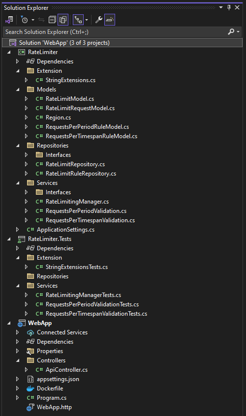
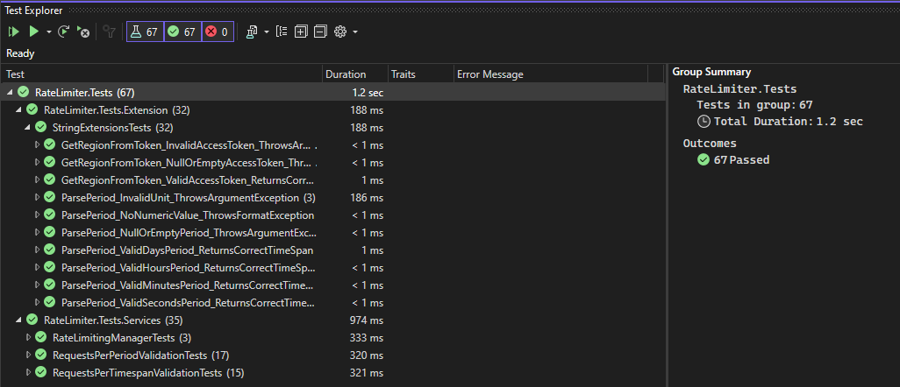
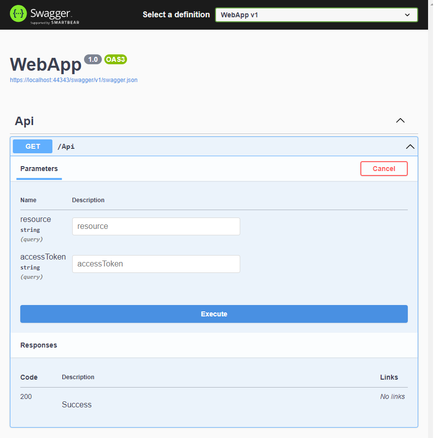

**Rate-limiting test project**

# TASK:
Rate limiting involves restricting the number of requests that can be made by a client.
A client is identified with an access token, which is used for every request to a resource.
To prevent abuse of the server, APIs enforce rate-limiting techniques.
Based on the client, the rate-limiting application can decide whether to allow the request to go through or not.
The client makes an API call to a particular resource; the server checks whether the request for this client is within the limit.
If the request is within the limit, then the request goes through.
Otherwise, the API call is restricted.

Some examples of request-limiting rules (you could imagine any others)
* X requests per timespan;
* a certain timespan passed since the last call;
* for US-based tokens, we use X requests per timespan, for EU-based - certain timespan passed since the last call.

The goal is to design a class(-es) that manage rate limits for every provided API resource by a set of provided *configurable and extendable* rules. For example, for one resource you could configure the limiter to use Rule A, for another one - Rule B, for a third one - both A + B, etc. Any combinations of rules should be possible, keep this fact in mind when designing the classes.

_______

#Solution

#Tests

#API
